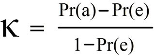
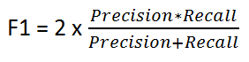

```{r setup, include=FALSE} 
knitr::opts_chunk$set(warning = FALSE, message = FALSE) 
```


# Overview

This report is related to the HarvardX: PH125.9x Data Science: Capstone.

The objective of this analysis is to find the factors that separates good from bad wine and build a model that can predict the quality of the wine.

It consists of six parts:

It starts with this **Overview** that summarizes this analysis document contents

The **Introduction** sections provides the goal of the analysis and the dataset that will be used.

In **Data analysis** section an exploratory data analysis of the dataset is performed

In **Methods and Analysis** section, machine learning algorithms  are developed that predicts and separate the best wine based on their quality from the rest

**Results** section presents the modeling results and discusses the model performance.

**Conclusion** is the summary of what was learned from this analysis and if its goal was achieved.


# Introduction

I am  Greek, so naturally I am also fan of good red wine.In Greek mythology, Dionysus is the god of wine and a major figure of the Olympian pantheon. The divine functions of both wine and Dionysus are often connected. In this analysis i will try to find the factors that separates good from bad (and mediocre wine).

 In order to develop  a red wine quality model, I will use  data from Kraggle <https://www.kaggle.com/uciml/red-wine-quality-cortez-et-al-2009> that original donated to UCI Machine learning Repository by  P. Cortez, A. Cerdeira, F. Almeida, T. Matos and J. Reis. 
For more details, consult the following link <https://archive.ics.uci.edu/ml/datasets/wine+quality>  Due to privacy and logistic issues, only physicochemical (inputs) and sensory (the output) variables are available (e.g. there is no data about grape types, wine brand, wine selling price, etc.).


Import libraries and seed


```{r message=FALSE}

if (!require("rpart")) install.packages("pacman")
if (!require("corrplot")) install.packages("corrplot")
if (!require("dplyr")) install.packages("dplyr")
if (!require("caret")) install.packages("caret")
if (!require("ggplot2")) install.packages("ggplot2")
if (!require("rpart.plot")) install.packages("rpart.plot")
if (!require("corrplot")) install.packages("corrplot")
if (!require("pROC")) install.packages("pROC")
if (!require("tidyr")) install.packages("tidyr")


library(dplyr)
library(rpart)
library(caret)
library(rpart.plot)
library(ggplot2)
library(corrplot)
library(pROC)
library(tidyr)


set.seed(1, sample.kind="Rounding")

```


# Data Analysis

Use the read.csv function to load the data. Afterwards loop through all columns and check if something is missing.

```{r message=FALSE}


wine<-read.csv("winequality-red.csv")


missing<- wine %>% 
  is.na() %>% 
  colSums()
data.frame(missing)


```


Data are good and there are no missing values. It is time to explore the data.


```{r message=FALSE}

str(wine)

```


The data frame has 1599 observations  and 12 variables:

1 - fixed acidity

2 - volatile acidity

3 - citric acid

4 - residual sugar

5 - chlorides

6 - free sulfur dioxide

7 - total sulfur dioxide

8 - density

9 - pH

10 - sulphates

11 - alcohol

12 - quality (score between 0 and 10)


Lets examine the data to get more information about its distribution and research if it has outliers or other problems

```{r}
summary(wine$quality)
summary(wine)

table(wine$quality)
prop.table(table(wine$quality))

ggplot(data.frame(wine), aes(x=quality)) +
  geom_bar()+
  scale_x_continuous(limits = c(2, max(wine$quality)+1), breaks = round(seq(3,8)))+
 xlab("Quality") +
  ylab("Count") +
  ggtitle("Wine quality")

```


The data seems to follow a normal bell shaped distribution centered around five and then six. Most wines are average. Moreover we have very few values at both ends of the range of quality.


```{r}

mean(wine$quality)
sd(wine$quality)

quantile(as.integer(wine$quality), .95)
```

By searching to find a good cutoff to separate the bad (and average wines) from the really good ones, wine quality of 7 is the best candidate.

A graphical display of a correlation matrix shows that alcohol, sulphates and volatile.acitidy has the biggest correlation with wine quality.

```{r}
corrplot(cor(wine), method="number")

wine%>%ggplot(aes(factor(quality), alcohol, group=quality))+geom_boxplot()+ggtitle("Alcohol & Quality")

```


Boxplot shows that alchocol, the variable that affects mostly quality, has many outliers at the quality value of 5 and this can affect the process of seperating the good from the bad wines.


A factor is created named status with two values good or bad based on wine quality. This is the output value that will be predicted.

```{r}
wine$status = factor(ifelse(wine$quality >=  7, "good", "bad"))
wine<-mutate(wine%>%dplyr::select(-quality))
```

```{r}

table(wine$status)
prop.table(table(wine$status))

```

13.5% of the wines are of good quality.

# Methods Analysis

The dataset needs to be partitioned to set up a train dataset and a test dataset.


```{r}

test_index <- createDataPartition(wine$status, times = 1, p = 0.75, list = FALSE)

wine_train<-wine[test_index ,]

wine_test<-wine[-test_index ,]
```


A box plot of each of the predictors visually evaluates the train data.


```{r}
wine_train%>%
  gather(-status, key = "var", value = "value") %>% 
  ggplot(aes(x = status, y = value, color = status)) +
  geom_boxplot() +
  facet_wrap(~ var, scales = "free", ncol = 3)+
  theme(legend.position="none")
```


## Regression Tree Model

I begin by training a regression model tree using the default values. 


```{r}

rpart_model<-train(status~.,data=wine_train, method = "rpart")
rpart_model

```


The optimal model that was selected seems to has good accuracy but has low Kappa. Kappa static adjusts accuracy by accounting the possibility of the agreement occurring by chance. This is important for this dataset as it has  class imbalance. The good class appears far less frequently than bad class.

{width=20%}

At the formula Pr(a) refers to the actual agreement between the predictions and the actual values. Pr(e) refers to the expected agreement between the predictions and the actual values.


The calculation of variables by train of the model produced an interesting result. Although alcohol and sulphates are evaluated by the model as the important factors and as predicted by initial data analysis, citric.acid steals third place from volatile.acidity.


```{r}

varImp(rpart_model)

plot(varImp(rpart_model))

```

It is time to evaluate the model's performance.

```{r}

rpart_predictor<-predict(rpart_model, wine_test)

plot(rpart_model$finalModel, margin=0.1)
text(rpart_model$finalModel, cex=0.75)
confusionMatrix(rpart_predictor,wine_test$status)


```

The evaluation shows that the model achieved high sensitivity but low specificity. Though it achieved a general good accuracy, the prediction of the good wine is far from adequate. Moreover it is observable from the tree plot that the model used only two variables. High percentage of alcohol seems to be very important for a good wine so it should not be abused.

These two variables by themselves are not good enough to separate food from bad wine.

```{r}

ggplot(wine, aes(alcohol, sulphates, color = status)) + geom_point()

```

Maybe the model can perform better if I tune the cp parameter. I will use also repeated k-Fold cross-validation for the  model. Repeated k-fold cross-validation will improve the estimated performance by repeating the cross-validation procedure multiple times and reporting the mean result across all folds from all runs. 

```{r}
tunegrider = data.frame(cp=seq(0,0.04, len=200))
train_control <- trainControl(method="repeatedcv", number=10, repeats=3)
rpart_model<-train(status~.,data=wine_train, method = "rpart",
  tuneGrid=tunegrider,trControl=train_control)

ggplot(rpart_model,highlight = TRUE)


plot(rpart_model$finalModel, margin=0.05)
text(rpart_model$finalModel, cex=0.55)

rpart_predictor<-predict(rpart_model, wine_test)

rpart_model$bestTune

rpart_model$finalModel

confusionMatrix(rpart_predictor,wine_test$status)

```

The model now used more predictors and achieved better results. Nevertheless the specificity is very low. We will try another algorithm.

  
## k-Nearest Neighbors Model

This time a K-nn algorithm will be used as it is simple and effective. I will tune the k parameter  and use also repeated k-Fold cross-validation for the  model.

```{r}
train_control <- trainControl(method="repeatedcv", number=10, repeats=3)
knn_model<-train(status~.,data=wine_train, method = "knn",trControl=train_control,
tuneGrid=data.frame(k=seq(1,10,0.5)))
knn_predictor<-predict(knn_model, wine_test)

knn_model$bestTune

knn_model$finalMode

ggplot(knn_model, highlight = TRUE)


confusionMatrix(knn_predictor,wine_test$status)


```

The model needs more tuning. Because K-nn is depended on measurement scale of the predictors, predictors that have greater ranges impact more. To eliminate this effect i will normalize the data.

```{r}
normalize <- function(x) {
  return ((x - min(x)) / (max(x) - min(x)))
}

wine_n <- as.data.frame(lapply(wine[1:11], normalize))


wine_n$status<-wine$status


summary(wine_n)


```

Now that the data are normalized a new train and test dataset are created to evalute the k-nn model.

```{r}

test_index_n <- createDataPartition(wine$status, times = 1, p = 0.75, list = FALSE)

wine_train_n <-wine[test_index_n  ,]

wine_test_n <-wine[-test_index_n  ,]


train_control <- trainControl(method="repeatedcv", number=10, repeats=3)
knn_model<-train(status~.,data=wine_train_n, method = "knn",
trControl=train_control, tuneGrid=data.frame(k=seq(1,10,0.5)))
knn_predictor<-predict(knn_model, wine_test_n)

knn_model$bestTune

knn_model$finalMode

ggplot(knn_model, highlight = TRUE)

confusionMatrix(knn_predictor,wine_test_n$status)

```

The result is a good accuracy combined with the best specificity and balanced accuracy so far. Separating good from average/bad wines is not an easy job as it seems. 

## Random Forest Model

Finally, i will use Random Forest as it is a good all-purpose model, that performs very good on most of the problems. I will tune  the model using ntree, mtry and metric parameter. Ntree is the number of trees to grow and because the problem appears a little difficult , a value more than default of 500 will be used. Kappa will be used as training metric as there is a problem with low specificity and Kappa in the models`s results till now. Mry parameter is the number of variables randomly sampled as candidates at each split.


```{r}
rfTunegrider = data.frame(mtry=seq(2,6, 0.5))
train_control <- trainControl(method="repeatedcv", number=10, repeats=3)
random_model<-train(status~.,data=wine_train, method = "rf",
metric="Kappa", tuneGrid=rfTunegrider,trControl=train_control,ntree = 1000)

random_predictor<-predict(random_model, wine_test)
result<-confusionMatrix(random_predictor,wine_test$status)

result

random_model$bestTune

random_model$finalModel

ggplot(random_model,highlight = TRUE)
```

Random forest achieved the best accuracy of all the models in this analysis combined with relatively satisfactory specificity and a good balanced accuracy. As i sought a balance between precision and recall a high f-score suggests success of the model.

{width=30%}


```{r}
result$byClass["F1"]
```

A ROC curve helps visualize the trade off between sensitivity and specificity at various threshold settings and better evaluate the model.

```{r}

evalResult.rf <- predict(random_model, wine_test, type = "prob")


random_roc<-roc(wine_test$status,evalResult.rf[,2])

plot(random_roc)
```

AUC (Area Under Curve ) that measures the entire two-dimensional area underneath the entire ROC curve suggests that the classifier has excellent predictive value.

```{r}
auc(random_roc)
```

# Results

The best candidate for separating good wines for the rest was the wine quality of 7. After research, it was found that the best predictors for wine quality is alcohol, sulphates, and volatile acidity. Three models were built to predict wine quality, a regression tree model, a k-nearest neighbours’ model and a random forest model.

Regression tree model achieved an accuracy of 0.8747 with a sensitivity of 0.9594 but also with a low specificity of 0.3333 and Kappa of 0.3535.

A fine tuned k-nearest neighbours’ model attained an accuracy of  0.8521, and a more balanced  sensitivity of 0.9014 and specificity of 0.5370. The kappa value was 0.4097.

Ultimately,  a random forest model was tuned and achieved an accuracy of 0.9023, sensitivity of 0.9739 and specificity of 0.4444. Kappa value reached a decent value  of 0.5004. Furthermore, test accuracy was calculated with an  f1-score of 0.9451477.


# Conclusion

The best wine is subjective, it is the one that makes you happy. According to this analysis though, the factors that makes a wine stand out is the high alcohol content (more that 11.5%) and the influence of its
sulphates, volatile acidity and citric acid.

Its relatively difficult though to separate the finest wine from the rest, as wines quality follows a normal distribution and most of them are average. Regression tree model was inadequate especially in founding the finest of the wines suffering from low specificity.

The k-nearest neighbors algorithm based model, especially its tuned version solved this problem, but without achieving excellent accuracy. Random forest model with an accuracy of 0.9023 and f1-score of 0.9451477 ensures that next time we will be able to distinguish the good Portugal red wine.

